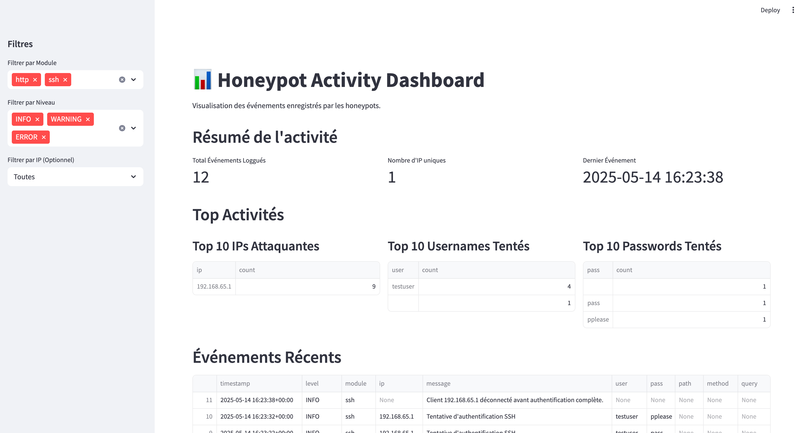
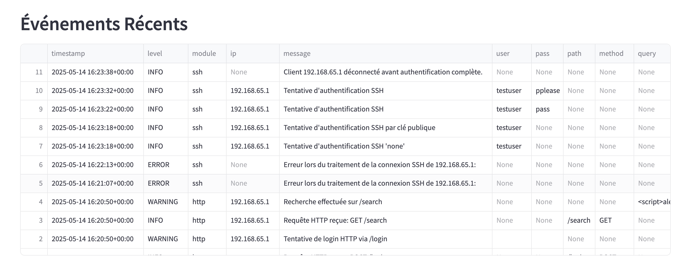

# 🛡️ Honeypot Lab

> Un environnement de cybersécurité simulé pour capter, journaliser et analyser des activités réseau malveillantes (SSH, HTTP, FTP).  
> Comprend un logger centralisé, un dashboard interactif, et un déploiement Dockerisé.

---

## 🚀 Aperçu visuel

### Dashboard en Streamlit


### Exemple de logs capturés


---

### 🎯 Objectif du projet

Ce projet a été réalisé dans un cadre personnel et exploratoire, pour :

- comprendre le fonctionnement des honeypots (leur utilité réelle en cybersécurité),

- expérimenter la capture de données réseau malveillantes en conditions contrôlées,

- apprendre à manipuler des outils Python orientés réseau (Paramiko, Flask, pyftpdlib),

- se familiariser avec le logging structuré (JSON), la visualisation en Streamlit et le déploiement via Docker.

Il ne s'agit ni d'un outil de production, ni d'une solution de sécurité professionnelle, mais plutôt d'un laboratoire d'apprentissage interactif autour de la cybersécurité défensive.


---

## ⚙️ Fonctionnalités

- 🧲 **SSH Honeypot** : Simule un serveur SSH (`port 2222`), accepte tous les logins et enregistre les identifiants.
- 🌐 **HTTP Honeypot** : Faux serveur web (`port 8080`) avec formulaires piégés (XSS, SQLi simulés).
- 📁 **FTP Honeypot** : Simule un serveur FTP (`port 2121`), loggue toutes les commandes (USER, PASS, LIST...).
- 🪵 **Logger centralisé** : Tous les événements sont stockés au format JSON (dans `/logs`), triés par jour.
- 📊 **Dashboard Web (Streamlit)** : Affiche les IP attaquantes, types d’attaques, payloads, etc.
- 🔧 **Fichier de config JSON** : Activez ou désactivez chaque service via `config/honeypot_config.json`.
- 🐳 **Compatible Docker / Docker Compose**

---

## 📦 Prérequis

- Python 3.8+
- pip
- Git
- Docker (optionnel mais recommandé)
- Docker Compose (pour lancement automatisé)

---

## Installation

1.  **Cloner le dépôt :**
    ```bash
    git clone <URL_DU_REPO>
    cd honeypot-lab
    ```

2.  **(Optionnel mais recommandé) Créer et activer un environnement virtuel :**
    ```bash
    python -m venv venv
    source venv/bin/activate  # Sur Linux/macOS
    # venv\Scripts\activate  # Sur Windows
    ```

3.  **Installer les dépendances :**
    ```bash
    pip install -r requirements.txt
    ```

4.  **(Optionnel mais recommandé) Générer une clé serveur SSH :**
    Pour rendre le honeypot SSH plus réaliste et éviter que `paramiko` en génère une à chaque fois.
    ```bash
    ssh-keygen -t rsa -b 2048 -f server_key -N ""
    ```
    Cela créera les fichiers `server_key` et `server_key.pub`. Le fichier `server_key` sera utilisé par le honeypot SSH.

## Configuration

Modifiez le fichier `config/honeypot_config.json` pour activer ou désactiver les modules honeypot et configurer les chemins de logs :

```json
{
  "enable_ssh": true,       // Activer le honeypot SSH
  "enable_http": true,      // Activer le honeypot HTTP
  "enable_ftp": false,     // Désactiver le honeypot FTP
}
```

🕓 À propos des timestamps (UTC vs heure locale)
Par défaut, tous les événements enregistrés dans les logs sont horodatés en UTC (+00:00), ce qui peut entraîner un décalage apparent avec votre heure locale.

Par exemple :

Un événement affiché à 16:00+00:00 correspond à 18:00 en heure de Paris (UTC+2).

🔧 Comment ajuster à votre fuseau horaire
Si vous souhaitez que le dashboard affiche l'heure dans votre fuseau local (ex: Europe/Paris), vous pouvez modifier ce bloc dans dashboard/web_ui.py :
```
import pytz 

# Après avoir chargé le DataFrame df :
if 'timestamp' in df.columns:
    df['timestamp'] = pd.to_datetime(df['timestamp']).dt.tz_convert('Europe/Paris')
```

## Exécution

Vous pouvez lancer l'application de deux manières :

### 1. Exécution Locale (avec Python)

Assurez-vous d'avoir installé les dépendances (`pip install -r requirements.txt`).

*   **Lancer les honeypots :**
    Ouvrez un terminal et lancez :
    ```bash
    python run.py
    ```
    Cela démarrera les honeypots activés dans la configuration et affichera leur statut.

*   **Lancer le Dashboard :**
    Ouvrez un *autre* terminal et lancez :
    ```bash
    streamlit run dashboard/web_ui.py
    ```
    Accédez ensuite au dashboard via votre navigateur à l'adresse indiquée (généralement `http://localhost:8501`).

### 2. Exécution avec Docker Compose

C'est la méthode recommandée car elle gère les services et les dépendances de manière isolée.

1.  **Construire et démarrer les conteneurs :**
    À la racine du projet, lancez :
    ```bash
    docker-compose up --build -d
    ```
    *   `--build` force la reconstruction de l'image si le code a changé.
    *   `-d` lance les conteneurs en arrière-plan (detached mode).

2.  **Accéder aux services :**
    *   Les honeypots écouteront sur les ports définis dans `docker-compose.yml` (par défaut : 2222, 8080, 2121).
    *   Le dashboard sera accessible sur `http://localhost:8501`.

3.  **Arrêter les conteneurs :**
    ```bash
    docker-compose down
    ```

## Logs Applicatifs

Les logs détaillés des événements (connexions, requêtes, tentatives de login) sont enregistrés au format JSON dans le répertoire `logs/`. Ces fichiers sont utilisés par le dashboard.


##  Exemples de commandes pour tester

# SSH Honeypot
ssh -p 2222 testuser@localhost

# HTTP Honeypot
curl http://localhost:8080
curl -X POST -d "user=admin&pass=admin" http://localhost:8080/login

# FTP Honeypot
ftp localhost 2121

